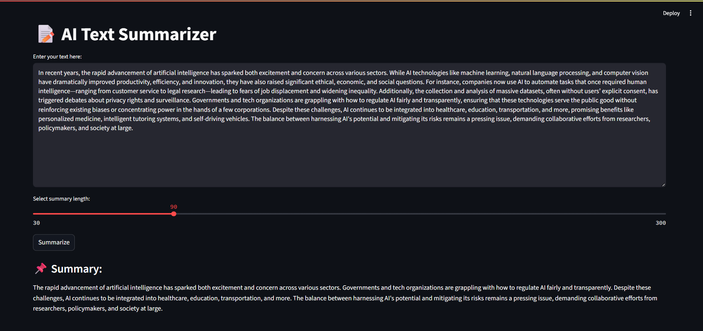

# 📝 AI Text Summarizer

A simple Streamlit web app that summarizes long texts using the `facebook/bart-large-cnn` model from Hugging Face Transformers.

## 🚀 Features

- Customizable summary length
- Built with Streamlit
- Uses a powerful BART model for abstractive summarization

## 📦 Requirements

Install dependencies:
```bash
pip install -r requirements.txt

🖥️ Run the App

Command: streamlit run summarizer.py


## 📸 Screenshot

